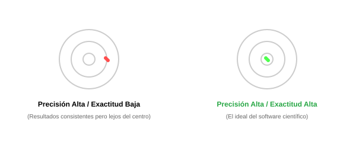
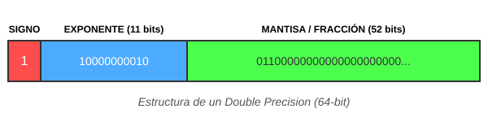

# Preconceptos: El Lenguaje de la Precisión Computacional

Hola, soy tu profesor GemPreConceptos. Antes de empezar a programar algoritmos complejos, necesitamos asegurarnos de que hablamos el mismo idioma que las computadoras. Una computadora no es infinita, y eso cambia las reglas de la matemática tradicional.

## 1. Precisión vs. Exactitud

- **Definición**: La **exactitud** es qué tan cerca está una medida del valor real. La **precisión** es qué tan consistentes son las medidas entre sí.
- **Visualización**:
  
- **Por qué es fundamental**: En software, podemos tener un algoritmo muy preciso (siempre da el mismo resultado con 10 decimales) pero poco exacto (el resultado está mal). Diferenciar esto te ahorrará horas de debugging.
- **Importancia**: 10/10

## 2. El Techo del Mundo Digital: Punto Flotante

- **Definición**: Es la forma en que las computadoras guardan números decimales (como 3.1415...). Como la memoria es finita, la computadora tiene que "cortar" el número en algún punto.
- **Por qué es fundamental**: Si sumas `0.1 + 0.2` en muchos lenguajes, no obtendrás `0.3`, sino `0.30000000000000004`. Entender que esto no es un error del lenguaje, sino una limitación física, es la base de los métodos numéricos.
- **Visualización Estándar (IEEE 754)**:
  
- **Importancia**: 10/10

## 3. Iteración: La Magia de Repetir

- **Definición**: Es el proceso de repetir un conjunto de instrucciones para acercarse poco a poco a una solución.
- **Por qué es fundamental**: Casi todos los métodos numéricos son "adivinanzas inteligentes" que se repiten miles de veces hasta que el error es tan pequeño que no nos importa.
- **Importancia**: 9/10

## 4. Notación Científica

- **Definición**: Una forma de escribir números muy grandes o muy pequeños usando potencias de 10 (ej: 1.5 x 10^8).
- **Por qué es fundamental**: Los algoritmos numéricos manejan números que van desde el tamaño de un átomo hasta la distancia a las estrellas. Necesitas sentirte cómodo leyendo `1.2e-7` en tu consola.
- **Importancia**: 8/10

---

## Lección Introductoria: Bienvenidos al Módulo 0

Aprender métodos numéricos es como aprender a ser un artesano de la matemática. En la escuela nos enseñaron que `x + 2 = 5` tiene una solución exacta: `x = 3`. Pero en el mundo real, muchas ecuaciones no tienen una solución tan simple.

Imaginen que quieren saber cuánta agua pasa por un río con curvas irregulares. No hay una fórmula perfecta para eso. Aquí es donde entran los métodos numéricos: dividimos el río en pedazos pequeños, calculamos cada uno y los sumamos.

En este curso, aprenderás a pedirle a la computadora que haga el trabajo sucio por ti, pero con la sabiduría necesaria para saber cuándo la computadora te está mintiendo debido a sus limitaciones de memoria. ¡Empecemos!
