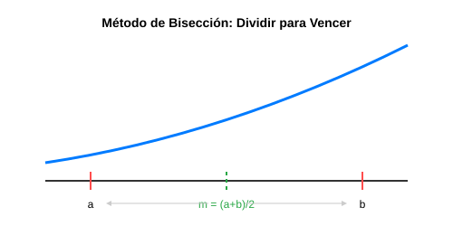

# Módulo 1.1: Métodos Cerrados para Búsqueda de Raíces

En análisis numérico, la búsqueda de raíces consiste en encontrar los valores de $x$ para los cuales una función $f(x)$ es igual a cero ($x$ tal que $f(x) = 0$). Los métodos cerrados, también conocidos como métodos de intervalos, requieren dos valores iniciales que encierren a la raíz.

## 1. El Teorema del Valor Intermedio

Para que exista una raíz en un intervalo $[a, b]$, la función $f(x)$ debe ser continua y cambiar de signo en los extremos del intervalo. Matemáticamente:
$$f(a) \cdot f(b) < 0$$

## 2. Método de Bisección

El método de bisección es un algoritmo de búsqueda incremental que divide el intervalo a la mitad repetidamente. Es robusto y siempre converge si se cumple la condición inicial, aunque su velocidad es relativamente lenta.

### Lógica del Algoritmo

1. Definir un intervalo $[a, b]$ tal que $f(a)$ y $f(b)$ tengan signos opuestos.
2. Calcular el punto medio: $m = (a + b) / 2$.
3. Si $f(a) \cdot f(m) < 0$, la raíz está en $[a, m]$. Entonces, $b = m$.
4. Si $f(a) \cdot f(m) > 0$, la raíz está en $[m, b]$. Entonces, $a = m$.
5. Repetir hasta que el error sea menor que la tolerancia deseada.



### 🖥️ Simulador Interactivo

Explora cómo se divide el intervalo visualmente:
[Simulador de Bisección](../../assets/simulaciones/biseccion_sim.html)

### Implementación en Python

```python
def biseccion(f, a, b, tol=1e-5):
    if f(a) * f(b) >= 0:
        print("El método de bisección falla: f(a) y f(b) deben tener signos opuestos.")
        return None

    while (b - a) / 2 > tol:
        punto_medio = (a + b) / 2
        if f(punto_medio) == 0:
            return punto_medio
        elif f(a) * f(punto_medio) < 0:
            b = punto_medio
        else:
            a = punto_medio

    return (a + b) / 2

# Ejemplo: Buscar raíz de f(x) = x^2 - 4
func = lambda x: x**2 - 4
raiz = biseccion(func, 0, 5)
print(f"La raíz aproximada es: {raiz}")
```

## 3. Método de Falsa Posición (Regula Falsi)

A diferencia de la bisección, este método no usa el punto medio exacto, sino que une los puntos $f(a)$ y $f(b)$ con una línea recta. La intersección de esta línea con el eje $x$ es la nueva aproximación.

$$m = b - \frac{f(b)(a - b)}{f(a) - f(b)}$$

Este método suele converger más rápido que la bisección en funciones suaves, pero puede estancarse si un extremo del intervalo no se mueve.

---

**Ejercicio sugerido**: Modifica el código de bisección para implementar el método de Falsa Posición y compara cuántas iteraciones toma encontrar la raíz de $f(x) = e^x - 3x$.
