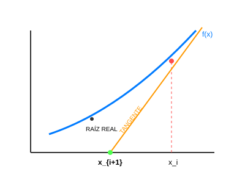

# Módulo 1.2: Métodos Abiertos para Búsqueda de Raíces

A diferencia de los métodos cerrados, los métodos abiertos no requieren un intervalo que encierre la raíz. Basan su búsqueda en un solo valor inicial (o dos que no necesariamente encierran la raíz). Son mucho más eficientes y rápidos, pero tienen el riesgo de divergir (alejarse de la solución).

## 1. El Método de Newton-Raphson: La Analogía del Faro

Imagina que estás en un campo oscuro buscando una casa (la raíz). No puedes ver la casa, pero tienes una linterna potente.

1. Apuntas la linterna al suelo y ves hacia dónde baja la colina (**la derivada/tangente**).
2. Sigues esa dirección en línea recta hasta que llegas al nivel del mar (**eje x**).
3. Ese nuevo punto será tu siguiente posición. Repites el proceso y, como la colina suele guiarte al valle, llegarás a la casa muchísmo más rápido que si caminaras al azar.

### Interpretación Geométrica



### 🖥️ Simulador Interactivo

Observa cómo las tangentes saltan hacia la raíz:
[Simulador de Newton-Raphson](../../assets/simulaciones/newton_sim.html)

### Fórmula Iterativa

$$x_{i+1} = x_i - \frac{f(x_i)}{f'(x_i)}$$
_En términos de software: `Nuevo_Valor = Valor_Actual - Error / Velocidad_de_Cambio`._

### Ventajas

- Convergencia cuadrática (muy rápida una vez cerca de la raíz).
- Solo requiere un punto inicial.

### Desventajas

- Requiere conocer la derivada $f'(x)$.
- Si $f'(x)$ es cercana a cero, el método puede fallar catastróficamente.

## 2. El Método de la Secante

Es una variación de Newton-Raphson para casos donde la derivada es difícil de calcular. Sustituye la derivada por una aproximación basada en dos puntos previos.

$$x_{i+1} = x_i - \frac{f(x_i)(x_{i-1} - x_i)}{f(x_{i-1}) - f(x_i)}$$

## 3. Implementación en Python (Newton-Raphson)

```python
def newton_raphson(f, df, x0, tol=1e-5, max_iter=100):
    x = x0
    for i in range(max_iter):
        fx = f(x)
        dfx = df(x)

        if abs(dfx) < 1e-10:
            print("Error: Derivada cercana a cero.")
            return None

        x_nuevo = x - fx / dfx

        if abs(x_nuevo - x) < tol:
            print(f"Convergencia lograda en {i+1} iteraciones.")
            return x_nuevo

        x = x_nuevo

    print("El método no convergió.")
    return None

# Ejemplo: Buscar raíz de f(x) = x^3 - x - 1
f = lambda x: x**3 - x - 1
df = lambda x: 3*x**2 - 1
raiz = newton_raphson(f, df, 1.5)
print(f"La raíz por Newton-Raphson es: {raiz}")
```

## 4. Comparativa de Métodos

| Característica     | Bisección               | Newton-Raphson           |
| :----------------- | :---------------------- | :----------------------- |
| **Convergencia**   | Siempre (si f(a)f(b)<0) | No garantizada           |
| **Velocidad**      | Lenta (Lineal)          | Muy rápida (Cuadrática)  |
| **Requerimientos** | 2 puntos (Intervalo)    | 1 punto + Derivada       |
| **Uso Ideal**      | Al inicio (para cercar) | Al final (para precisar) |

---

**Nota para Software**: En producción, se suele usar un método híbrido: bisección para acercarse a la raíz y luego Newton-Raphson para obtener la precisión final.
