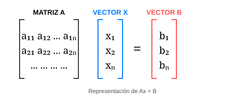

# Módulo 2.1: Métodos Directos para Sistemas de Ecuaciones Lineales

En ingeniería de software, resolver sistemas de la forma $Ax = B$ es fundamental para áreas como los gráficos 3D, el análisis de redes y la optimización de procesos.



Los métodos directos proporcionan la solución exacta (ignorando errores de redondeo) en un número finito de pasos.

## 1. Eliminación Gaussiana

Es el método clásico de reducción para obtener una matriz triangular superior.

### Proceso de Implementación

1. **Eliminación hacia adelante**: Se transforman los elementos debajo de la diagonal principal en ceros mediante operaciones por filas.
2. **Sustitución hacia atrás**: Se resuelven las incógnitas empezando desde la última fila hacia la primera.

> [!IMPORTANT] > **Pivoteo Parcial**: Para evitar dividir por cero o números muy pequeños (que causan errores de precisión), siempre debemos buscar el elemento de mayor valor absoluto en la columna actual y mover esa fila al lugar del pivote.

## 2. Descomposición LU

Consiste en factorizar la matriz $A$ en dos matrices: una triangular inferior ($L$) y una triangular superior ($U$), tales que $A = LU$.

- **Ventaja**: Si tienes que resolver el mismo sistema con diferentes vectores $B$, la descomposición LU es mucho más rápida que repetir la eliminación gaussiana.

## 3. Implementación en Python (Eliminación Gaussiana con Pivoteo)

```python
import numpy as np

def eliminacion_gaussiana(A, B):
    n = len(B)
    # Matriz aumentada
    M = np.hstack([A, B.reshape(-1, 1)]).astype(float)

    for i in range(n):
        # Pivoteo parcial
        max_row = i + np.argmax(np.abs(M[i:, i]))
        M[[i, max_row]] = M[[max_row, i]]

        # Eliminación
        for j in range(i + 1, n):
            factor = M[j, i] / M[i, i]
            M[j, i:] -= factor * M[i, i:]

    # Sustitución hacia atrás
    x = np.zeros(n)
    for i in range(n - 1, -1, -1):
        x[i] = (M[i, n] - np.dot(M[i, i+1:n], x[i+1:n])) / M[i, i]

    return x

# Ejemplo:
A = np.array([[3, 2, -1], [2, -2, 4], [-1, 0.5, -1]])
B = np.array([1, -2, 0])
solucion = eliminacion_gaussiana(A, B)
print(f"Solución: {solucion}")
```

---

**Nota Técnica**: Aunque NumPy ya tiene `np.linalg.solve()`, entender el "cómo" te permite optimizar algoritmos para hardware específico o situaciones de memoria limitada.
