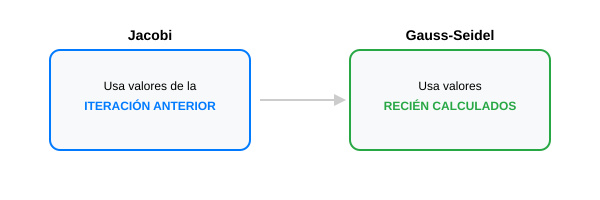

# Módulo 2.2: Métodos Iterativos para Sistemas Lineales

Cuando trabajamos con sistemas de ecuaciones extremadamente grandes (como simulaciones de fluidos o redes neuronales), los métodos directos pueden ser muy lentos o requerir demasiada memoria. Los métodos iterativos encuentran soluciones aproximadas mediante repeticiones, siendo más eficientes en matrices "dispersas" (con muchos ceros).

## 1. El Método de Jacobi

Consiste en despejar cada variable $x_i$ en términos de las demás y usar valores previos para calcular los nuevos. Todas las variables se actualizan simultáneamente al final de cada iteración.

## 2. El Método de Gauss-Seidel

Es una mejora del método de Jacobi. En lugar de esperar al final de la iteración para usar los nuevos valores, Gauss-Seidel usa los valores recién calculados de la misma iteración inmediatamente. Por lo general, converge mucho más rápido.



### 🖥️ Simulador Interactivo (2x2)

Observa la trayectoria de convergencia hacia la solución:
[Simulador de Gauss-Seidel](../../assets/simulaciones/gauss_seidel_sim.html)

> [!NOTE] > **Condición de Convergencia**: Estos métodos funcionan de manera confiable si la matriz $A$ es **diagonalmente dominante** (el elemento de la diagonal es mayor que la suma de los demás elementos de su fila).

## 3. Implementación en Python (Gauss-Seidel)

```python
def gauss_seidel(A, B, x0, tol=1e-5, max_iter=50):
    n = len(B)
    x = x0.copy().astype(float)

    for k in range(max_iter):
        x_viejo = x.copy()
        for i in range(n):
            suma = sum(A[i, j] * x[j] for j in range(n) if i != j)
            x[i] = (B[i] - suma) / A[i, i]

        # Verificar convergencia
        if np.linalg.norm(x - x_viejo, ord=np.inf) < tol:
            print(f"Convergencia lograda en {k+1} iteraciones.")
            return x

    print("El método no convergió.")
    return x

# Ejemplo:
A = np.array([[4, 1, 2], [3, 5, 1], [1, 1, 3]])
B = np.array([4, 7, 3])
x_inicial = np.zeros(3)
solucion = gauss_seidel(A, B, x_inicial)
print(f"Solución Gauss-Seidel: {solucion}")
```

---

**Ejercicio de reflexión**: ¿Por qué crees que un motor de videojuegos preferiría un método iterativo sobre uno directo para simular la física de miles de objetos?
