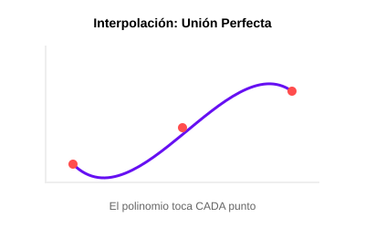

# Módulo 3.1: Interpolación Polinómica

Imagina que tienes datos de la temperatura cada hora, pero quieres saber la temperatura exacta a los 45 minutos. La interpolación permite "unir los puntos" mediante un polinomio que pase exactamente por todos ellos para predecir valores intermedios.



## 1. Interpolación de Lagrange

El polinomio de Lagrange es una forma elegante de construir un polinomio único que pase por un conjunto de puntos $(x_i, y_i)$.

- **Concepto**: Se construye una función de peso $L_i(x)$ para cada punto, de modo que sea 1 en $x_i$ y 0 en cualquier otro punto del conjunto.
- **Desventaja**: Si se añade un nuevo punto, hay que recalcular todo el polinomio desde cero.

### 🖥️ Simulador Interactivo

Dibuja tus propios puntos y observa cómo el polinomio se ajusta a ellos:
[Simulador de Interpolación](../../assets/simulaciones/interpolador_sim.html)

## 2. Diferencias Divididas de Newton

Es un método más eficiente y flexible para construir el mismo polinomio.

- **Ventaja**: Permite añadir nuevos puntos de datos de forma incremental sin repetir todos los cálculos previos. Es ideal para aplicaciones de software donde los datos llegan en tiempo real.

## 3. Implementación en Python (Lagrange)

```python
def interpolacion_lagrange(x_puntos, y_puntos, x_objetivo):
    n = len(x_puntos)
    resultado = 0

    for i in range(n):
        termino = y_puntos[i]
        for j in range(n):
            if i != j:
                termino *= (x_objetivo - x_puntos[j]) / (x_puntos[i] - x_puntos[j])
        resultado += termino

    return resultado

# Ejemplo:
x = [1, 2, 4]
y = [1, 4, 16] # f(x) = x^2
p_45 = interpolacion_lagrange(x, y, 3)
print(f"Valor interpolado en x=3: {p_45} (Esperado: 9)")
```

---

**Nota de Software**: Aunque la interpolación es potente, ten cuidado con el **Fenómeno de Runge**: usar polinomios de grado muy alto (muchos puntos) puede causar oscilaciones salvajes en los bordes. En software avanzado, solemos usar "Splines" (polinomios por trozos).
