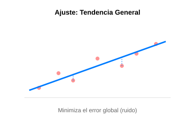

# Módulo 3.2: Ajuste de Curvas y Regresión

A diferencia de la interpolación, donde el polinomio _debe_ pasar por los puntos, en el ajuste de curvas buscamos una función que represente la **tendencia general** de los datos, incluso si no pasa exactamente por cada punto. Esto es vital cuando los datos tienen "ruido" o errores de medición.



## 1. Regresión por Mínimos Cuadrados

Es la técnica más común. Busca minimizar la suma de los cuadrados de las diferencias (residuos) entre los puntos reales y la función de ajuste.

### ¿Por qué al cuadrado?

- Para que los errores positivos y negativos no se cancelen entre sí.
- Para penalizar más fuertemente a los puntos que están muy lejos de la línea de tendencia.

### 🖥️ Simulador Interactivo

Agrega puntos con ruidos y observa cómo la matemática encuentra la tendencia:
[Simulador de Regresión Lineal](../../assets/simulaciones/regresion_sim.html)

## 2. Regresión Lineal

Buscamos la mejor línea recta $y = a_0 + a_1 x$ que describa los datos. Para encontrar $a_0$ y $a_1$, resolvemos un pequeño sistema de ecuaciones lineales (aplicando lo que aprendimos en el Módulo 2).

## 3. Implementación en Python (Regresión Lineal Simple)

```python
import numpy as np

def regresion_lineal(x, y):
    n = len(x)
    sum_x = np.sum(x)
    sum_y = np.sum(y)
    sum_xy = np.sum(x * y)
    sum_x2 = np.sum(x**2)

    # Pendiente (a1)
    a1 = (n * sum_xy - sum_x * sum_y) / (n * sum_x2 - sum_x**2)
    # Intercepto (a0)
    a0 = (sum_y - a1 * sum_x) / n

    return a0, a1

# Datos con ruido de una tendencia y = 2x + 1
x_datos = np.array([1, 2, 3, 4, 5])
y_datos = np.array([3.1, 4.9, 7.2, 8.8, 11.1])

a0, a1 = regresion_lineal(x_datos, y_datos)
print(f"Modelo ajustado: y = {a0:.2f} + {a1:.2f}x")
```

---

**Caso de Uso**: Imagina que estás monitoreando el uso de CPU de un servidor. El ajuste de curvas te permite predecir en cuántas horas el servidor alcanzará el 100% de capacidad para escalar preventivamente.
