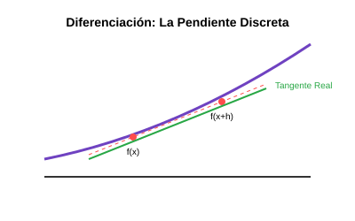

# Módulo 4.1: Diferenciación Numérica

En el mundo continuo, la derivada de una función en un punto representa la pendiente de la recta tangente. En el mundo discreto (digital), no tenemos funciones continuas infinitas, sino colecciones de puntos. La diferenciación numérica nos permite calcular esa pendiente usando solo los valores de los puntos.



## 1. Aproximación por Diferencias Finitas

Existen tres formas básicas de aproximar una derivada basándose en la serie de Taylor:

1. **Diferencias Hacia Adelante**: Usa el punto actual y el siguiente.
2. **Diferencias Hacia Atrás**: Usa el punto actual y el anterior.
3. **Diferencias Centradas**: Usa el punto anterior y el siguiente. **Es la más exacta** porque el error se cancela simétricamente.

$$\text{Diferencia Centrada: } f'(x) \approx \frac{f(x+h) - f(x-h)}{2h}$$

## 2. El Riesgo del Paso $h$

- Si $h$ (la distancia entre puntos) es muy grande, la aproximación es mala.
- Si $h$ es extremadamente pequeño (ej. $10^{-16}$), la computadora comete errores de redondeo al restar números casi iguales. Existe un "punto óptimo" para $h$ que minimiza ambos errores.

### 🖥️ Simulador Interactivo

Explora cómo cambia el error al variar el tamaño del paso $h$:
[Simulador de Error de Diferenciación](../../assets/simulaciones/diferenciacion_sim.html)

## 3. Implementación en Python (Diferencias Finitas)

```python
def derivada_centrada(f, x, h=1e-5):
    return (f(x + h) - f(x - h)) / (2 * h)

# Ejemplo: f(x) = sin(x), su derivada es cos(x)
import math
f = math.sin
punto = math.pi / 4 # 45 grados

aprox = derivada_centrada(f, punto)
real = math.cos(punto)

print(f"Derivada aproximada: {aprox}")
print(f"Derivada real:       {real}")
print(f"Error: {abs(real - aprox)}")
```

---

**Aplicación en Software**: Los motores de física usan esto para calcular la velocidad partiendo de la posición, o la aceleración partiendo de la velocidad en cada "frame" del juego.
