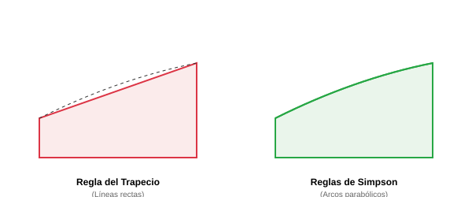

# Módulo 4.2: Integración Numérica

La integración representa el área bajo una curva. En software, esto es útil para calcular totales acumulados, como la distancia total recorrida por un vehículo o el consumo total de energía de un sensor a lo largo del tiempo.

## 1. Regla del Trapecio

Divide el área bajo la curva en trapecios en lugar de rectángulos. Es simple y fácil de implementar, pero requiere muchos intervalos para ser exacta en curvas muy pronunciadas.

## 2. Reglas de Simpson (1/3 y 3/8)

En lugar de unir los puntos con líneas rectas (trapecios), las reglas de Simpson usan parábolas (polinomios de segundo grado) para aproximar la curva.

- **Simpson 1/3**: Requiere que el número de intervalos sea par. Es mucho más exacto que el trapecio con la misma cantidad de puntos.
- **Simpson 3/8**: Se usa cuando el número de intervalos es múltiplo de 3. Se puede combinar con Simpson 1/3 para cualquier cantidad de datos.



### 🖥️ Simulador Interactivo

Visualiza cómo los trapecios y parábolas llenan el área bajo la curva:
[Simulador de Integración](../../assets/simulaciones/integrador_sim.html)

## 3. Implementación en Python (Simpson 1/3)

```python
def simpson_13(f, a, b, n):
    if n % 2 != 0:
        raise ValueError("n debe ser un número par para Simpson 1/3")

    h = (b - a) / n
    suma = f(a) + f(b)

    for i in range(1, n):
        x = a + i * h
        if i % 2 == 0:
            suma += 2 * f(x)
        else:
            suma += 4 * f(x)

    return (h / 3) * suma

# Ejemplo: Integrar f(x) = x^2 desde 0 a 3
# El resultado exacto es [x^3/3] de 0 a 3 = 9
f = lambda x: x**2
area = simpson_13(f, 0, 3, 100)
print(f"Área aproximada (Simpson 1/3): {area}")
```

---

**Ejercicio**: Compara la exactitud de la Regla del Trapecio vs Simpson 1/3 para integrar $f(x) = \frac{1}{x}$ desde 1 hasta 2. El valor real es $\ln(2) \approx 0.6931$.
