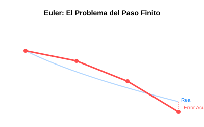

# Módulo 5.1: Introducción a las Ecuaciones Diferenciales Ordinarias (ODEs)

Una Ecuación Diferencial Ordinaria (ODE) relaciona una función desconocida con su propia derivada. En términos sencillos, describe **cómo cambia algo** en función de su estado actual.

- **Ejemplo**: La temperatura de un café caliente baja a una velocidad proporcional a la diferencia entre su temperatura y la del ambiente.

## 1. El Método de Euler

Es el método más sencillo y la base de todos los algoritmos de integración temporal en videojuegos y simulaciones.

### ¿Cómo funciona?

Supongamos que conocemos la posición actual de un coche y su velocidad. Para saber dónde estará en un segundo, simplemente sumamos a la posición actual el producto de la velocidad por el tiempo.

$$y_{i+1} = y_i + f(t_i, y_i) \cdot h$$

- $y_i$: Estado actual.
- $f(t_i, y_i)$: La derivada (pendiente/velocidad).
- $h$: El paso de tiempo (delta time).

## 2. Limitaciones del Método de Euler

- **Inestabilidad**: Si el paso de tiempo $h$ es muy grande, la simulación "explota" (los valores se vuelven infinitos).
- **Inexatitud**: Acumula mucho error rápidamente. Por eso, en software profesional, casi nunca se usa Euler solo, sino variaciones más avanzadas.



### 🖥️ Simulador Interactivo

Observa cómo el paso $h$ afecta la "suavidad" de la curva:
[Simulador de Euler](../../assets/simulaciones/euler_sim.html)

## 3. Implementación en Python (Método de Euler)

```python
import numpy as np
import matplotlib.pyplot as plt

def euler(f, y0, t):
    y = np.zeros(len(t))
    y[0] = y0
    for i in range(0, len(t) - 1):
        h = t[i+1] - t[i]
        y[i+1] = y[i] + f(t[i], y[i]) * h
    return y

# Ejemplo: dy/dt = -0.5 * y (Enfriamiento/Decaimiento)
f = lambda t, y: -0.5 * y
t = np.linspace(0, 10, 100)
solucion = euler(f, 10, t)

plt.plot(t, solucion)
plt.title("Método de Euler")
plt.show()
```

---

**Dato Curioso**: Casi todos los motores de física de bajo costo (como los de juegos móviles sencillos) usan "Euler Integrator". Los motores AAA como Unreal Engine usan métodos mucho más estables.
