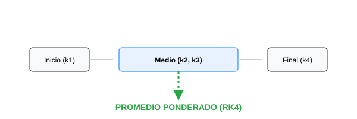

# Módulo 5.2: Métodos de Runge-Kutta (RK4)

Si el método de Euler es como caminar en línea recta basándote solo en lo que ves bajo tus pies, el método de **Runge-Kutta de 4to Orden (RK4)** es como tener un GPS que promedia 4 puntos diferentes para decidir cuál es el mejor camino a seguir.

## 1. El Método de Runge-Kutta: La Analogía del Promedio de Votos

Si el método de Euler es como preguntarle el camino a una sola persona (que podría estar equivocada), el método de **Runge-Kutta de 4to Orden (RK4)** es como preguntarle a 4 expertos diferentes y promediar sus respuestas:

1. **k1**: Lo que nos dice la pendiente al inicio.
2. **k2 y k3**: Consultamos la pendiente a mitad del camino para ver si algo cambió.
3. **k4**: Consultamos la pendiente al final del tramo.
   Al promediar estas 4 "opiniones", el camino resultante es muchísimo más suave y preciso. Es el estándar de oro en simulaciones de vuelo y dinámica de fluidos.



### 🖥️ Simulador Interactivo

Compara la estabilidad de Euler vs la precisión de RK4 en tiempo real:
[Simulador de ODEs](../../assets/simulaciones/ode_sim.html)

## 3. Implementación en Python (RK4)

```python
def rk4(f, y0, t):
    y = np.zeros(len(t))
    y[0] = y0
    for i in range(0, len(t) - 1):
        h = t[i+1] - t[i]
        k1 = f(t[i], y[i])
        k2 = f(t[i] + h/2, y[i] + h/2 * k1)
        k3 = f(t[i] + h/2, y[i] + h/2 * k2)
        k4 = f(t[i] + h, y[i] + h * k3)

        y[i+1] = y[i] + (h/6) * (k1 + 2*k2 + 2*k3 + k4)
    return y

# Ejemplo con la misma función: dy/dt = -0.5 * y
f = lambda t, y: -0.5 * y
t = np.linspace(0, 10, 100)
sol_rk4 = rk4(f, 10, t)
```

## 4. Euler vs Runge-Kutta

| Característica      | Euler                      | Runge-Kutta 4                             |
| :------------------ | :------------------------- | :---------------------------------------- |
| **Complejidad**     | Muy baja                   | Moderada                                  |
| **Precisión**       | Baja (1er orden)           | Muy alta (4to orden)                      |
| **Estabilidad**     | Mala                       | Excelente                                 |
| **Uso en Software** | Prototipos, juegos simples | Simuladores de vuelo, dinámica de fluidos |

---

**Desafío**: Implementa el lanzamiento de una pelota de béisbol considerando la gravedad y la resistencia del aire usando RK4. Verás que la trayectoria es mucho más realista que con Euler.
