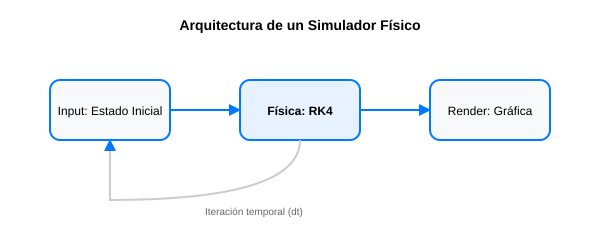

# Módulo 6.1: Proyecto Integrador - Simulador de Trayectoria con RK4

¡Felicidades! Has llegado al final del recorrido teórico. Ahora es momento de aplicar todo lo aprendido para construir una herramienta realista: un **Simulador de Trayectoria de Proyectiles** que considere la gravedad y la resistencia del aire (arrastre).



## 1. El Problema Físico

Un proyectil se mueve en dos dimensiones ($x, y$). Las fuerzas que actúan sobre él son:

- **Gravedad**: Tira hacia abajo ($g = 9.81 m/s^2$).
- **Arrastre (Drag)**: Se opone al movimiento y depende de la velocidad al cuadrado.

## 2. Las Ecuaciones Diferenciales

Tenemos un sistema de ODEs de segundo orden que descomponemos en un sistema de primer orden:

1. $\frac{dx}{dt} = v_x$
2. $\frac{dy}{dt} = v_y$
3. $\frac{dv_x}{dt} = - \frac{k}{m} \cdot v \cdot v_x$
4. $\frac{dv_y}{dt} = -g - \frac{k}{m} \cdot v \cdot v_y$

Donde $v = \sqrt{v_x^2 + v_y^2}$ es la magnitud de la velocidad.

## 3. Estructura del Software

Tu simulador debe:

1. Recibir los parámetros iniciales (ángulo, velocidad inicial, masa, coeficiente de arrastre).
2. Usar el método de **Runge-Kutta de 4to Orden** para resolver el sistema en cada paso.
3. Detenerse cuando el proyectil toque el suelo ($y \le 0$).
4. Graficar la trayectoria resultante.

## 4. Implementación Base del Motor

```python
import numpy as np
import matplotlib.pyplot as plt

def simulador_proyectil(v0, angulo_deg, k=0.1, m=1.0, dt=0.01):
    g = 9.81
    angulo_rad = np.radians(angulo_deg)

    # Estado inicial: [x, y, vx, vy]
    estado = np.array([0.0, 0.0, v0 * np.cos(angulo_rad), v0 * np.sin(angulo_rad)])

    trayectoria = [estado[:2].copy()]

    def derivadas(t, s):
        x, y, vx, vy = s
        v = np.sqrt(vx**2 + vy**2)
        ax = -(k/m) * v * vx
        ay = -g - (k/m) * v * vy
        return np.array([vx, vy, ax, ay])

    while estado[1] >= 0:
        # Paso RK4
        k1 = derivadas(0, estado)
        k2 = derivadas(0, estado + dt/2 * k1)
        k3 = derivadas(0, estado + dt/2 * k2)
        k4 = derivadas(0, estado + dt * k3)

        estado += (dt/6) * (k1 + 2*k2 + 2*k3 + k4)
        trayectoria.append(estado[:2].copy())

    return np.array(trayectoria)

# Prueba del simulador
tray = simulador_proyectil(v0=50, angulo_deg=45)
plt.plot(tray[:,0], tray[:,1])
plt.xlabel("Distancia (m)")
plt.ylabel("Altura (m)")
plt.title("Simulación de Proyectil con RK4 y Arrastre")
plt.show()
```

---

**Desafío Final**: Añade una interfaz gráfica (usando `Streamlit` o `Tkinter`) donde el usuario pueda mover deslizadores para cambiar el viento y ver cómo cambia la trayectoria en tiempo real. ¡Has pasado de bachiller a desarrollador de software científico!
