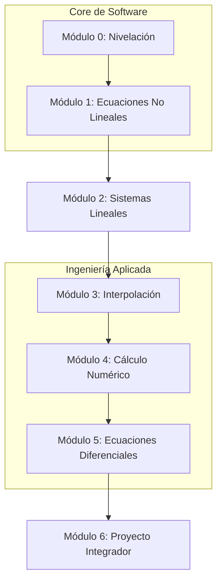

# ARQUITECTURA CURRICULAR: MÉTODOS NUMÉRICOS APLICADOS EN SOFTWARE

## METADATA

- **Complejidad**: Alta (De 0 a Experto)
- **Duración estimada**: 60 Horas
- **Audiencia objetivo**: Bachilleres interesados en ingeniería de software y ciencias
- **Prerrequisitos obligatorios**:
  1. Matemáticas de secundaria (Álgebra, concepto básico de funciones)
  2. Conceptos básicos de programación (Variables, bucles, condicionales)
- **Fecha de diseño**: 2025-12-30

## MAPA CONCEPTUAL



## OBJETIVOS GENERALES DEL CURSO

1. Comprender la aritmética de punto flotante y la gestión de errores en sistemas computacionales.
2. Implementar algoritmos numéricos fundamentales utilizando Python o JavaScript para resolver problemas del mundo real.
3. Evaluar la convergencia y eficiencia de diferentes métodos según la naturaleza del problema.
4. Construir un motor de cálculo integrador que aplique conceptos de optimización y simulación.

## ESTRUCTURA MODULAR

### MÓDULO 0: Aritmética Computacional y Errores

**Duración**: 6 horas
**Objetivo**: Comprender cómo las computadoras procesan números y por qué ocurren errores de redondeo.

#### Ruta Básica

- **Subtema 0.1.1**: Sistemas Numéricos (Binario, Hexadecimal). Objetivo: Conversión manual vs computacional. (60 min)
- **Subtema 0.1.2**: Estándar IEEE 754. Objetivo: Entender el almacenamiento de punto flotante. (60 min)
- **Subtema 0.1.3**: Tipos de Error (Absoluto, Relativo, Truncamiento). Objetivo: Calcular la propagación de errores. (120 min)

### MÓDULO 1: Búsqueda de Raíces

**Duración**: 10 horas
**Objetivo**: Resolver f(x)=0 mediante algoritmos iterativos.

- **Tema 1.1**: Métodos Cerrados (Bisección y Falsa Posición).
- **Tema 1.2**: Métodos Abiertos (Punto Fijo, Newton-Raphson, Secante).
- **Práctica**: Implementación de un buscador de raíces interactivo.

### MÓDULO 2: Álgebra Lineal Numérica

**Duración**: 10 horas
**Objetivo**: Resolver sistemas de ecuaciones AX=B eficientemente.

- **Tema 2.1**: Eliminación Gaussiana y Pivoteo Parcial.
- **Tema 2.2**: Descomposición LU.
- **Tema 2.3**: Métodos Iterativos (Jacobi y Gauss-Seidel).

### MÓDULO 3: Ajuste de Datos e Interpolación

**Duración**: 8 horas
**Objetivo**: Predecir valores entre puntos conocidos.

- **Tema 3.1**: Interpolación de Lagrange y Newton.
- **Tema 3.2**: Regresión Lineal y Mínimos Cuadrados.

### MÓDULO 4: Cálculo Diferencial e Integral Numérico

**Duración**: 10 horas
**Objetivo**: Integrar y derivar funciones cuando no existe una analítica.

- **Tema 4.1**: Diferenciación de alta precisión.
- **Tema 4.2**: Integración (Trapecio, Simpson 1/3, Simpson 3/8).

### MÓDULO 5: Solución de ODEs (Ecuaciones Diferenciales)

**Duración**: 8 horas
**Objetivo**: Modelar sistemas dinámicos que cambian en el tiempo.

- **Tema 5.1**: Método de Euler.
- **Tema 5.2**: Métodos de Runge-Kutta (4to orden).

### MÓDULO 6: Proyecto Integrador: Simulador de Física/Finanzas

**Duración**: 8 horas
**Objetivo**: Crear una aplicación que simule el movimiento de un proyectil con resistencia del aire o un modelo de interés compuesto avanzado.

---

## ESTRUCTURA JSON (Para Producción)

```json
[
  {
    "modulo_id": 0,
    "titulo": "Aritmetica Computacional y Errores",
    "temas": [
      {
        "tema_id": "0.1",
        "titulo": "Sistemas Numericos y Precision",
        "subtemas": [
          {
            "subtema_id": "0.1.1",
            "titulo": "Representacion Binaria y Hexadecimal"
          },
          { "subtema_id": "0.1.2", "titulo": "Estandar IEEE 754" },
          { "subtema_id": "0.1.3", "titulo": "Teoria de Errores" }
        ]
      }
    ]
  },
  {
    "modulo_id": 1,
    "titulo": "Solucion de Ecuaciones No Lineales",
    "temas": [
      {
        "tema_id": "1.1",
        "titulo": "Metodos Cerrados",
        "subtemas": [
          { "subtema_id": "1.1.1", "titulo": "Metodo de Biseccion" },
          { "subtema_id": "1.1.2", "titulo": "Metodo de Falsa Posicion" }
        ]
      },
      {
        "tema_id": "1.2",
        "titulo": "Metodos Abiertos",
        "subtemas": [
          { "subtema_id": "1.2.1", "titulo": "Newton-Raphson" },
          { "subtema_id": "1.2.2", "titulo": "Metodo de la Secante" }
        ]
      }
    ]
  },
  {
    "modulo_id": 2,
    "titulo": "Sistemas de Ecuaciones Lineales",
    "temas": [
      {
        "tema_id": "2.1",
        "titulo": "Metodos Directos",
        "subtemas": [
          { "subtema_id": "2.1.1", "titulo": "Eliminacion Gaussiana" },
          { "subtema_id": "2.1.2", "titulo": "Descomposicion LU" }
        ]
      },
      {
        "tema_id": "2.2",
        "titulo": "Metodos Iterativos",
        "subtemas": [
          { "subtema_id": "2.2.1", "titulo": "Iteracion de Jacobi" },
          { "subtema_id": "2.2.2", "titulo": "Gauss-Seidel" }
        ]
      }
    ]
  },
  {
    "modulo_id": 3,
    "titulo": "Interpolacion y Ajuste de Curvas",
    "temas": [
      {
        "tema_id": "3.1",
        "titulo": "Interpolacion Polinomica",
        "subtemas": [
          { "subtema_id": "3.1.1", "titulo": "Polinomios de Lagrange" },
          { "subtema_id": "3.1.2", "titulo": "Diferencias Divididas de Newton" }
        ]
      }
    ]
  },
  {
    "modulo_id": 4,
    "titulo": "Integracion y Derivacion Numerica",
    "temas": [
      {
        "tema_id": "4.1",
        "titulo": "Integracion Numerica",
        "subtemas": [
          { "subtema_id": "4.1.1", "titulo": "Regla del Trapecio" },
          { "subtema_id": "4.1.2", "titulo": "Reglas de Simpson 1/3 y 3/8" }
        ]
      }
    ]
  },
  {
    "modulo_id": 5,
    "titulo": "Ecuaciones Diferenciales Ordinarias",
    "temas": [
      {
        "tema_id": "5.1",
        "titulo": "Introduccion a ODEs",
        "subtemas": [
          { "subtema_id": "5.1.1", "titulo": "Metodo de Euler" },
          { "subtema_id": "5.1.2", "titulo": "Metodo de Runge-Kutta 4to Orden" }
        ]
      }
    ]
  },
  {
    "modulo_id": 6,
    "titulo": "Proyecto Integrador",
    "temas": [
      {
        "tema_id": "6.1",
        "titulo": "Casos de Uso Real",
        "subtemas": [
          { "subtema_id": "6.1.1", "titulo": "Desarrollo del Simulador" }
        ]
      }
    ]
  }
]
```
